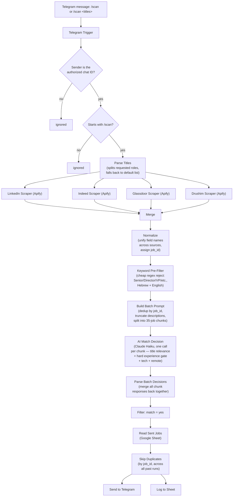

# Job Scanner — On-Demand Multi-Source Job Search Bot

A Telegram bot that scans LinkedIn, Indeed, Glassdoor, and Drushim (Israel's leading Hebrew job board) on command, filters results with an LLM against personal criteria (title relevance, seniority, tech stack, remote/hybrid), and delivers only genuinely matching, never-seen-before postings straight to chat.

## Why this exists

Off-the-shelf job alert tools don't cover this use case well: global platforms (LinkedIn, Indeed, Glassdoor) don't cover Israeli boards, and Israeli boards don't cover global platforms. Neither offers structured filtering on the two dimensions that matter most for a narrow search — **years of experience required** and **relevant technologies** — those are almost always buried in free-text descriptions, not structured fields.

The fix: assemble best-in-class scrapers for each platform, and use an LLM as the filtering layer that actually reads each posting and decides fit — instead of relying on keyword search alone.

## Architecture

## Design decisions

- **On-demand, not scheduled.** No cron trigger — the workflow only runs when you send `/scan` (or `/scan <titles>`) to the bot. Zero API/compute cost when you're not actively job hunting, full control over when it runs.
- **Dynamic search, not hardcoded.** `/scan Product Analyst` searches only that role; a bare `/scan` falls back to a default watchlist of roles. The AI filter's matching criteria are built from whatever was actually requested that run — not a fixed list baked into the prompt.
- **LLM as the real filter, not the scrapers.** Every scraper is queried with a simple keyword + location search. The heavy lifting — deciding if a posting *actually* fits (title relevance allowing synonyms, a hard "≤2 years experience, not senior/lead" gate, relevant tech, remote/hybrid preference) — happens in the AI step that reads the full job description per source language (Hebrew + English).
- **Cheap model choice.** Claude Haiku handles the matching — it's a classification task (yes/no + score + reason), not open-ended generation, so a small fast model is sufficient and keeps cost negligible even across hundreds of postings.
- **Two-tier filtering, not one.** A free regex pre-filter rejects postings with unambiguous seniority signals in the *title* (Senior/Director/VP/Head of, Hebrew equivalents too) before any AI call happens. It deliberately does **not** reject plain "Manager" — that would false-positive on "Customer Success Manager," one of the actual target roles. Everything else (experience stated only in the body text, nuanced title matching) is left to the LLM, which is the part that actually needs judgment.
- **Batched AI calls, chunked by real token math — not everything in one call.** Sending every posting to Claude individually (one API call each) works but is slow and wastes tokens re-sending the same system prompt every time. The fix: pack many postings into one prompt and get back a JSON array of decisions in a single call. The catch — a single very large batch (e.g. all ~350 postings from a 5-role default scan) blows past the model's context/output limits and the response gets truncated mid-JSON, silently losing every job after the cutoff. The real fix was **chunking**: split the (deduplicated) job list into groups sized from actual measured output cost (~180 tokens per decision, empirically — not guessed), not an arbitrary round number. At 8,000 max output tokens, that caps a safe chunk at ~35 jobs with margin. Each chunk becomes one Claude call — n8n fires one automatically per chunk item with no custom loop/retry logic needed, since a node in n8n runs once per item it receives. ~350 postings → ~10 calls, not 350 and not a single call that silently drops most of them.
- **Two separate dedup layers, solving two different problems.** (1) *Within a single run:* the same posting often surfaces under more than one searched title (e.g. both "Analyst" and "Product Analyst" turn up the same LinkedIn listing) — deduplicated by `job_id` before it ever reaches the AI, so it isn't paid for or evaluated twice in one scan. (2) *Across runs, over time:* a Google Sheet logs every `job_id` ever sent; every new match is checked against that log before delivery, so re-running `/scan` tomorrow doesn't repeat yesterday's results. The first has no memory between runs; the second is the only thing that does.
- **Description truncation caps at 8,000 characters, not 1,500.** An earlier version capped each job description at 1,500 characters before batching — cheap on tokens, but caught in testing sending a job requiring "5+ years of experience" as a match: the requirement sat in a `Requirements` section that came after a long `Responsibilities` list and got silently cut off before the AI ever saw it. Raised the cap to 8,000 (large enough that virtually any real posting fits whole, including its requirements section) while keeping *some* ceiling as a safety net against a single malformed scrape (already happened once, with Drushim's `descriptionFormat`) bloating an entire batch's token cost. This only affects input tokens, not the 8,000-max-output-tokens/35-jobs-per-chunk batching math, which are governed independently.
- **`job_id` is derived, not always native.** Not every source actor exposes a clean unique ID field. The fallback chain: a real ID from the source (`id`/`jobId`/`job_id`) → the posting's own URL (almost always unique) → title+company concatenated as a last resort. This is what both dedup layers above key off of.
- **No duplicate alerts, ever.** Every match is checked against the Google Sheet log before sending; only new postings get pushed, and every send is logged back to the sheet.

## Stack

| Layer | Tool |
|---|---|
| Orchestration | [n8n](https://n8n.io) (Cloud) |
| Scraping | [Apify](https://apify.com) actors — one per job source |
| Matching / filtering | Anthropic Claude (Haiku) |
| Delivery | Telegram Bot API |
| Dedup store | Google Sheets |

### Apify actors used

| Source | Actor | Notes |
|---|---|---|
| LinkedIn | `curious_coder/linkedin-jobs-scraper` | Takes a full LinkedIn search URL as input, not separate title/location fields |
| Indeed | `borderline/indeed-scraper` | `country` + `query` are required fields |
| Glassdoor | `valig/glassdoor-jobs-scraper` | Result-count field is named `limit`, not the more obvious `resultsLimit`/`maxItems` — confirmed by inspecting the actor's raw JSON input, not guessed |
| Drushim (Israel, Hebrew) | `blackfalcondata/drushim-scraper` | `descriptionFormat` defaults to `all` (every format variant concatenated — plain, HTML, markdown); set to `text` to avoid needlessly bloating every posting 2-3x over |

Each was picked after comparing multiple alternatives on the Apify store by rating, review count, and real 30-day active usage — not just star count alone (a few high-star actors turned out to have single-digit user counts). Every actor's real input schema was verified directly (Apify console → Input → JSON view) rather than assumed from the form labels, which caught several field-name mismatches (`limit` vs the guessed `resultsLimit`; `query` vs the guessed `position`) that would otherwise have silently returned zero results.

## Known gaps

- No coverage for AllJobs.co.il or JobMaster.co.il (no Apify actor exists for either).
- No `/help`, no saved role list, no 👍/👎 feedback loop.
- No daily spend cap on Apify/Claude usage.
- Cross-source dedup is exact by `job_id`, not fuzzy — the same posting on two boards can send twice.

## Setup (high level)

1. Create a Telegram bot via [@BotFather](https://t.me/BotFather), get the token and your chat ID.
2. Create an [Apify](https://apify.com) account and API token.
3. Create an [n8n Cloud](https://n8n.io) workspace, import the workflow, and wire up credentials (Telegram, Apify Bearer token, Anthropic API key, Google Sheets OAuth).
4. Create a Google Sheet with columns: `job_id`, `title`, `company`, `link`, `date_sent`, `posted_at`, `score`, `reason`, `status`.
5. Message your bot `/scan` or `/scan <role1, role2, ...>`.

## Status

Working end-to-end: a live `/scan` run against the default 5-role watchlist pulled ~485 raw postings across all 4 sources, ~353 survived the free keyword pre-filter, deduplication cut that further, and the chunked AI pass (35 postings per Claude call) correctly evaluated all of them — no truncation, no silently dropped jobs.
